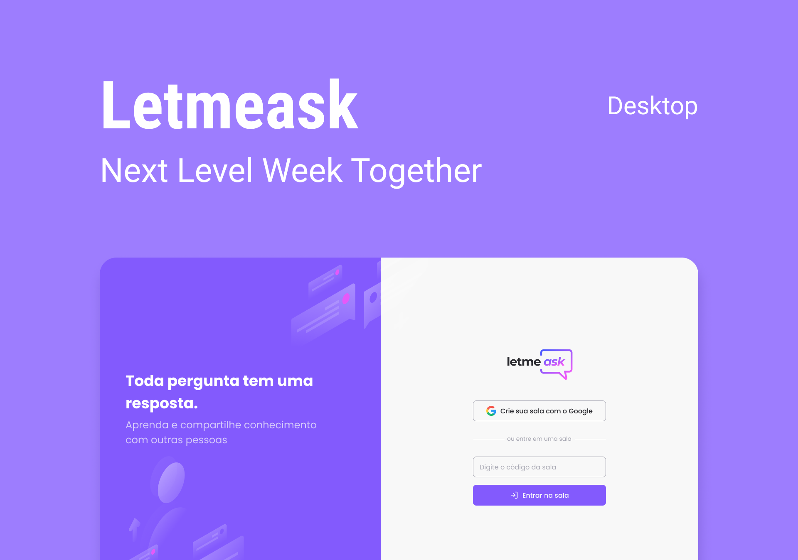

# Projeto criado na nlw-6 #together

<h1 align="center">
    
</h1>

<p align="center">
  <a href="#-project">Project</a>&nbsp;&nbsp;&nbsp;|&nbsp;&nbsp;&nbsp;
  <a href="#technologies">Technologies</a>&nbsp;&nbsp;&nbsp;|&nbsp;&nbsp;&nbsp;
  <!-- <a href="#-preview">Preview</a>&nbsp;&nbsp;&nbsp;|&nbsp;&nbsp;&nbsp; -->
  <a href="#-layout">Getting started</a>&nbsp;&nbsp;&nbsp;|&nbsp;&nbsp;&nbsp;  
  <a href="#-layout">Layout</a>&nbsp;&nbsp;&nbsp;|&nbsp;&nbsp;&nbsp;
  <a href="#-license">License</a>
</p>

<p align="center">
   
</p>

<br>

<p align="center">
  
</p>

## ?? Project

Letmeask helps you answer questions more efficiently ! ??

This is a project developed during the **[Next Level Week](https://nextlevelweek.com/)**

## ?? Technologies

This project was developed using the following technologies:

- [React](https://reactjs.org)
- [TypeScript](https://www.typescriptlang.org/)
- [HTML5]()
- [Sass]()
- [Firebase]()

## ?? Preview

[Deploy with Firebase](https://nlw-letmeask-afdc4.web.app/)

## ?? Getting started

Clone the project and access the folder

```bash
$ git clone https://github.com/arthurvenicio/nlw6-letmeask.git && cd nlw-letmeask
```

Follow the steps below

```bash
# Install the dependencies
$ yarn install

# Start the project
$ yarn start
```

## ?? Layout

You can view the project layout through the links below:

- [Layout Web](<https://www.figma.com/file/B39wAzVdMmlmFSZY44rmxN/Letmeask-(Copy)?node-id=0%3A1>)

## ?? License

This project is licensed under the MIT License. See the [LICENSE](LICENSE) file for details.
